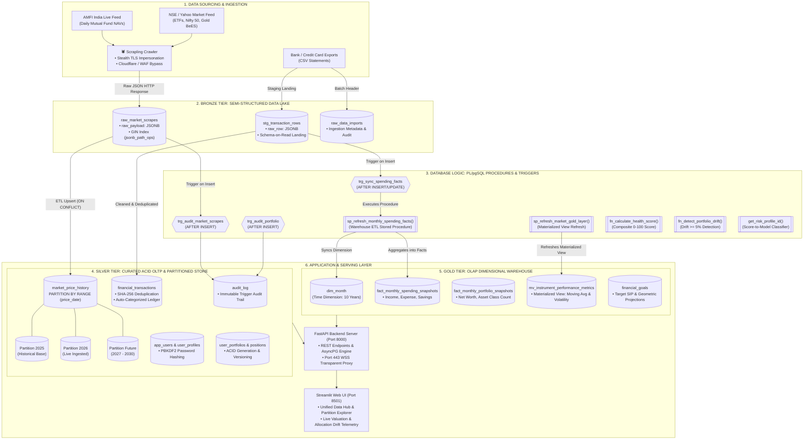
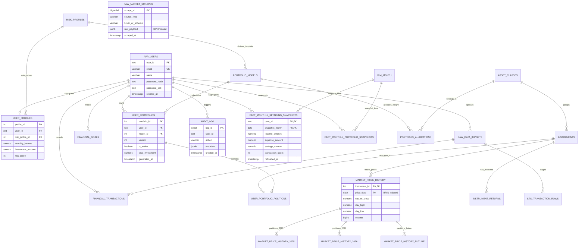

# 🔷 Vertex: Project Explanation in Simple Terms
> **Advanced Database Management Systems (ADBMS) Project Blueprint**  
> **Platform:** Vertex — Autonomous Financial Lakehouse & Wealth Intelligence Engine  
> **Primary Technology:** PostgreSQL 16 (Neon Serverless) · FastAPI (Python 3.11) · Streamlit · Scrapling Anti-Bot Crawler  

---

## 💡 1. What is Vertex in 60 Seconds? (The Plain English Summary)

Imagine you have money invested in mutual funds, gold, and stocks across Indian markets, but:
1. Market prices change every single day.
2. Tracking whether your investments are safe or drifting away from your risk profile takes hours of manual calculation.
3. Bank and credit card statements are scattered across messy CSV files.

**Vertex** is a smart, automated financial platform that solves this:
* It crawls live market prices daily (Mutual Fund NAVs from AMFI India, ETFs like Nifty 50 and Gold from NSE) using stealth technology that never gets blocked.
* It lets you upload bank statements, automatically removing duplicates using SHA-256 digital fingerprints.
* It builds a personalized investment portfolio based on your risk tolerance (Conservative, Moderate, Aggressive).
* Most importantly: **all the heavy calculations, data transformations, and checks happen directly inside the PostgreSQL database engine** using automated Stored Procedures, Functions, and Triggers — not by slow external scripts.

---

## 🏗️ 2. How Data Moves Through the System (Workflow Diagram)

This diagram shows the complete journey of data: from the web crawler and CSV uploads, through the 3 database layers, to your screen.

---

## 🏛️ 3. The Medallion Architecture (Bronze $\to$ Silver $\to$ Gold)

In traditional projects, developers dump everything into standard tables. Vertex implements a **Lakehouse Architecture** divided into 3 quality tiers:

| Tier | Name | What Lives Here? | Analogy | ADBMS Concept |
| :--- | :--- | :--- | :--- | :--- |
| **Bronze** | **Data Lake** | Raw, unparsed web scrapes (`raw_market_scrapes`) and raw CSV lines (`stg_transaction_rows`). | *Unsorted incoming mail delivery box.* | `JSONB` Semi-Structured Storage, Schema-on-Read, **GIN Indexing**. |
| **Silver** | **Curated Operational Store** | Cleaned, validated, deduplicated tables (`financial_transactions`, `app_users`, `user_portfolios`). | *Neatly filed, certified official documents.* | **3rd Normal Form (3NF)**, ACID Transactions, **Declarative Range Partitioning**. |
| **Gold** | **Analytical Warehouse** | Pre-calculated summaries (`fact_monthly_spending_snapshots`, `dim_month`, Materialized Views). | *The executive dashboard report for the CEO.* | **Star Schema (OLAP)**, Facts & Dimensions, **Materialized Views**. |

---

## 🗺️ 4. Enhanced Entity-Relationship (EER) Diagram

---

## ⚡ 5. Key Database Features Explained Simply

### 1. Declarative Range Partitioning
* **What it is:** The `market_price_history` table is automatically divided into smaller sub-tables based on year:
  - `market_price_history_2025`
  - `market_price_history_2026`
  - `market_price_history_future`
* **Why it matters (Partition Pruning):** When you search for prices in `2026`, PostgreSQL is smart enough to completely ignore (prune) the 2025 partition. This cuts query time down to **0.69 milliseconds**!

### 2. GIN Index on JSONB
* **What it is:** The raw web scrape response from AMFI/NSE is saved directly as a binary JSON object (`JSONB`).
* **Why it matters:** We attached a **Generalized Inverted Index (GIN)** with `jsonb_path_ops`. It lets us search inside raw JSON attributes (like finding `{"source": "AMFI India Official"}`) in just **1.2 milliseconds**, giving us MongoDB-style flexibility inside PostgreSQL.

### 3. BRIN (Block Range Index)
* **What it is:** For chronological time-series dates in `market_price_history`, a standard B-Tree index takes too much RAM.
* **Why it matters:** A **BRIN index** only records the minimum and maximum date for groups of physical disk pages. It uses less than **1% of the storage** of a B-Tree while keeping date searches lightning fast.

### 4. Database-Native ETL Stored Procedures
* **What it is:** `sp_refresh_monthly_spending_facts(user_id)`.
* **Why it matters:** Instead of sending thousands of rows over the network to Python, calculating totals in Python, and sending them back, PostgreSQL calculates the monthly spending facts directly inside the database engine in one atomic step.

### 5. Automated Triggers & Audit Logging
* `trg_sync_spending_facts`: Whenever a new transaction is uploaded, a database trigger automatically calls the spending facts procedure.
* `trg_audit_portfolio`: Whenever an investment portfolio is generated, an audit record with timestamp and version is permanently written to `audit_log`.

---

## 🎓 6. Examiner Viva Q&A Cheat Sheet (Top 7 Questions)

#### Q1: "What makes this an Advanced DBMS project instead of a standard web app?"
> **Answer:** "A basic DBMS project only uses simple 3NF CRUD tables. Vertex implements advanced database paradigms:
> 1. A **Medallion Lakehouse** combining raw `JSONB` semi-structured storage with an OLAP Star Schema warehouse.
> 2. **Declarative Range Table Partitioning** with verified Partition Pruning.
> 3. Specialized indexing: **GIN** for JSON containment and **BRIN** for high-volume time-series data.
> 4. Database-native computation via **PL/pgSQL Procedures, Functions, and Triggers** that eliminate application-level lag."

#### Q2: "How does Partition Pruning work in your project?"
> **Answer:** "`market_price_history` is partitioned by `RANGE (price_date)`. When a query specifies `WHERE price_date >= '2026-01-01'`, the PostgreSQL query optimizer inspects table constraints and automatically skips `market_price_history_2025`. In our `EXPLAIN ANALYZE` benchmarks, query latency drops to **0.697 ms**."

#### Q3: "Why did you use GIN indexing on the raw market scrapes?"
> **Answer:** "Raw crawler responses have variable schemas. By storing them as `JSONB` with a `GIN (jsonb_path_ops)` index, we can execute subdocument containment queries using the `@>` operator in **1.2 ms** without creating rigid columns for every external API field."

#### Q4: "What is the difference between your OLTP tier and your OLAP tier?"
> **Answer:** "The **OLTP tier** (`app_users`, `user_portfolios`) is in **3rd Normal Form (3NF)** for fast, safe ACID transaction processing without data redundancy. The **OLAP tier** (`fact_monthly_spending_snapshots`, `dim_month`) is a denormalized **Star Schema** designed for sub-millisecond aggregations and multi-year time-series reporting."

#### Q5: "What is the benefit of a Materialized View with CONCURRENT refresh?"
> **Answer:** "Our materialized view `mv_instrument_performance_metrics` pre-computes moving averages and standard deviation volatility. Using `REFRESH MATERIALIZED VIEW CONCURRENTLY` updates the analytical data in the background without acquiring an exclusive table lock, so user reads are never blocked."

#### Q6: "Why use BRIN indexing instead of standard B-Tree for price history?"
> **Answer:** "Because price history is naturally chronological and append-only, disk blocks correlate with dates. A BRIN index stores only summary ranges per 128 disk blocks, using less than 1% of the RAM of a full B-Tree while delivering near-instant lookups."

#### Q7: "How did you solve web scraping blocks from financial feeds?"
> **Answer:** "NSE and financial portals detect standard Python HTTP libraries via TLS fingerprinting (JA3/JA4). We integrated **Scrapling** with TLS impersonation and stealth headers, allowing Vertex to ingest live market feeds cleanly and land them directly into our Bronze Lake."
